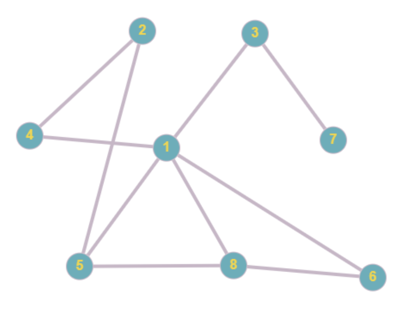

# Depth First Search Algorithm

## Exercise 1 (example)

Depth first search (DFS) is a common graph-traversal algorithm which explores the nodes of a graph starting from a starting node.

DFS explores as far as possible down each branch until there are no unvisited nodes to traverse, and backtracks up the branch until an unvisited branch is found. This is repeated until all nodes are visited.

The algorithm is as follows:
    1. Choose a node to start from
    2. Choose an unvisited neighbour and traverse to it
    3. Continue doing so until there are no more unvisited nodes to traverse to
    4. Backtrack up the branch and continue until all nodes are visited

Since nodes that are found latest are visited earliest, DFS uses a stack data structure to keep track of the nodes discovered so far along a given branch. Typically, DFS is typically implmeneted recurisvely, using the call-stack to allow backtracking, however DFS can also be implemented iteratively as well with an actual stack data structure.

In this example, depth first search is performed on the graph below. Run the example and study how the algorithm works.

