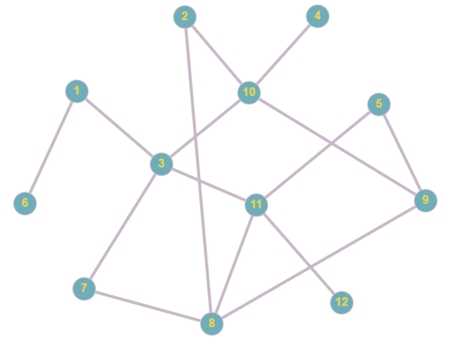

# Depth First Search Algorithm

## Exercise 2 (task)

Fill the blanks to use depth-first search to traverse the given graph, printing the order in which nodes are traversed as a list.

Below is the graph used for this task:

