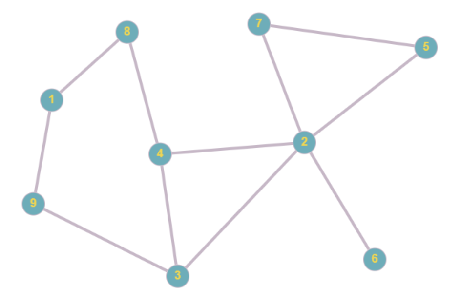

# Breadth First Search Algorithm

## Exercise 3 (example)

Breadth first search (BFS) is a common graph-traversal algorithm which explores the nodes of a graph starting from a starting node.

BFS explores all nodes that are closest to the starting node before expanding each branch to traverse the whole graph, which can be thought of as traversing nodes radially from the starting node. E.g. all nodes that are 1 edge away from the starting node are searched first, then all the nodes that are 2 edges away are searched next, so on and so forth until the whole graph is searched.

The algorithm is as follows:
    1. Choose a starting node and add it to a queue
    2. Dequeue the node from the front of the queue, and mark it as visited
    3. Add all unvisited neighbours of the current node to the queue
    4. Repeat until all nodes are visited

Since nodes that are found first are visited first, a queue data structure is used to store what nodes need to be searched next. Unlike depth first search, a queue is a necessary part of BFS, whilst in DFS a physical stack data structure is often unnecessary as the call-stack can be used.

In this example, breadth first search is performed on the graph below. Run the example and study how the algorithm works.

