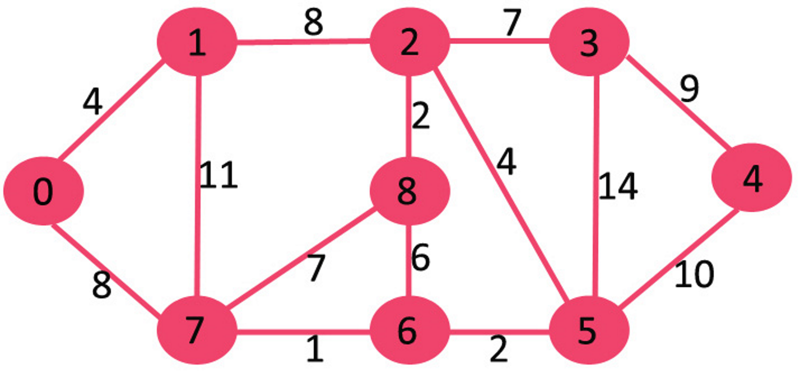

# Dijkstra's Algorithm

## Exercise 5 (example)

Dijkstra's algorithm is a common algorithm used to find the shortest path between two nodes on a weighted graph with positive weights.

The algorithm is as follows:
1. Choose a node to start from
2. Look at all the unvisited neighbours of the current node
3. Calculate the tentative distance through the current node by adding the shortest distance of the current node from the start and the weight of the edge between the two nodes.
4. If the tentative distance is smaller than the shortest distance recorded for that node, update its distance
    (initially all nodes have a distance of infinity from the start)
5. Mark the current node as visited
6. Set the current node to the closest unvisited node from the start
7. Repeat until all nodes are visited

This algorithm is typically implemented using two arrays, visited and distance, which store whether the node is currently visited and the shortest distance from the start respectively. You can also create a third array called previous to store the previous node in the shortest path from the start to each node, which can be used to trace the shortest path as well. To get the closest unvisited node from the start, a priority queue is typically used with the priority being the distance from the start.

In this example, dijkstra's algorithm is performed on the graph below. Run the example and study how it works carefully.
