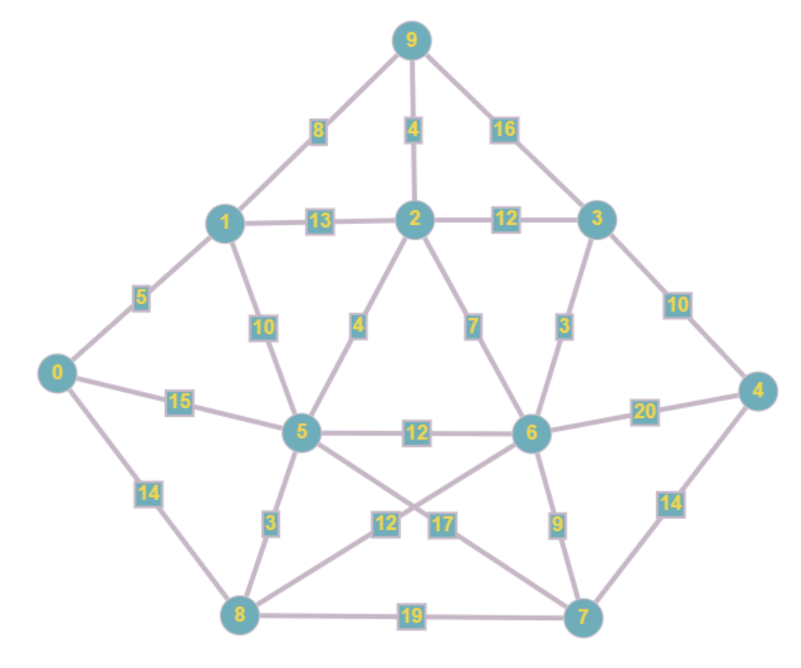

# Dijkstra's Algorithm

## Exercise 6 (task)

Fill the blanks to print the shortest path between node 0 and node 4. Print both the distance of the shortest path and the path itself.

Below is the graph used for this task:

