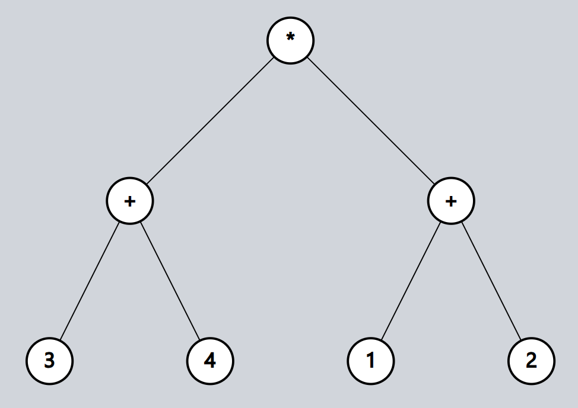

# Reverse Polish Notation

## Exercise 3 (example)

Reverse Polish Notation can also be obtained from the post-order traversal of an expression tree. 
An expression tree is a binary tree that represents an arithmetic expression, with operators making up parent nodes and operands making up leaf nodes.

Below is the expression tree for the infix expression (3 + 4) * (1 + 2):

Below are the steps to traverse a tree in post-order:
    1. Traverse the left subtree (if there is one)
    2. Traverse the right subtree (if there is one)
    3. Traverse the root node
    4. Keep doing this recursively

Run the example and study how it works carefully.
