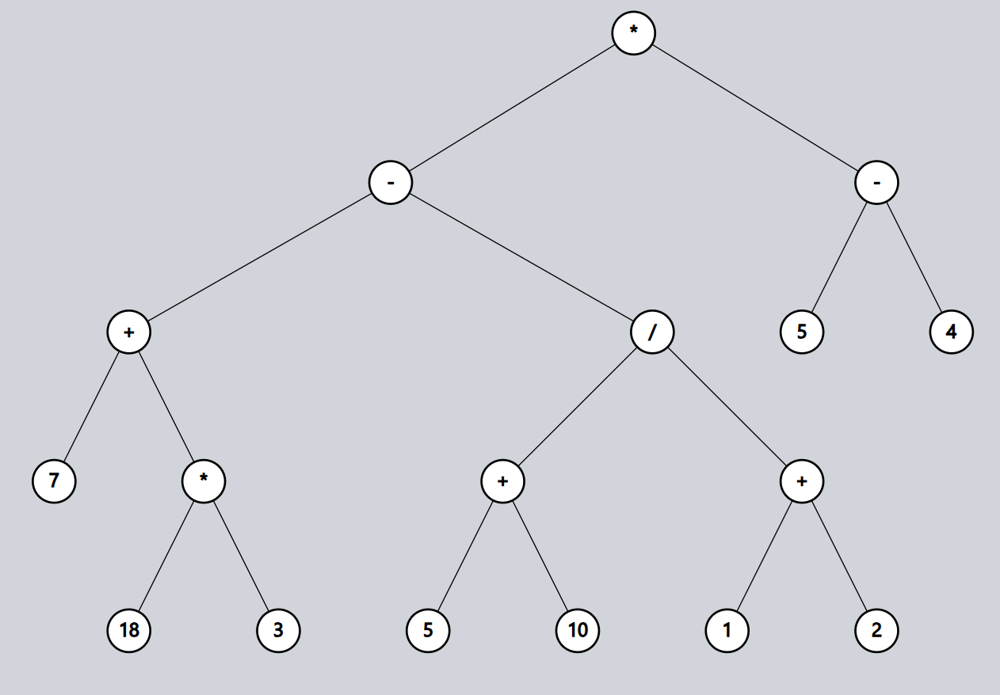

# Reverse Polish Notation

## Exercise 4 (task)

Fill the blanks to represent the expression tree given below using an array and use post-order traversal to obtain the RPN corresponding to this expression tree.

