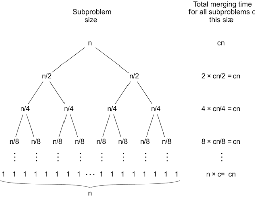

# Sorting Algorithms

## Exercise 3 (example)

Bubble sort is not an efficient algorithm for sorting - we can solve this problem *faster* using a different algorithm. One of the most common *efficient* sorting algorithms is **Merge sort**, which is a divide and conquer algorithm. A divide and conquer algorithm splits the problem into multiple parts, solves them recursively, and combines the results. It is by definition **recursive**, so we have a *base case* and *recursive case*:

**Base case**: Array has one element, we do nothing as it is already sorted

**Recursive case**:
1. Divide array into two halves
2. Recursively sort each half using merge sort
3. Merge each half into one sorted whole - this takes *linear* time.

Its time complexity is $O(n \log n)$, which makes it better than bubble sort. This example shows an implementation of Merge sort - study how it works.

### Extra details

We can draw a *recursion tree* for the merge sort algorithm showing each division. The tree has height $O(\log n)$ as we divide the size of the array in two each time. Level $i \ge 0$ (from the top) contains $2^i$ problem instances, each of size $n/2^i$. Since **merging is linear time**, the work done at level $i$ is $2^i \times O(n/2^i) = O(n)$. There are $O(\log n)$ levels, so the total complexity is $O(\log n) \times O(n) = O(n \log n)$.

**Fact**: All comparison-based sorting algorithms run in at least $O(n \log n)$ time, so Merge sort has an optimal time complexity.

