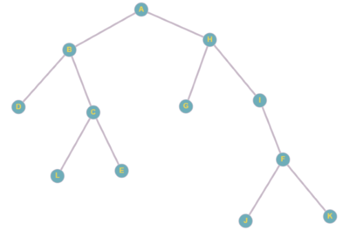

# Tree Traversal

## Exercise 2 (task)

Fill in the blanks to complete the pre-order, in-order and post-order traversal of the tree presented below, printing out the order in which nodes are visited.

